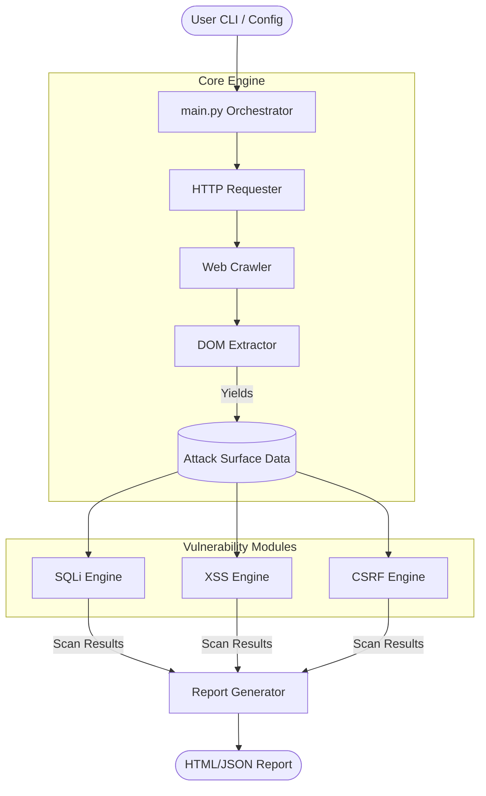
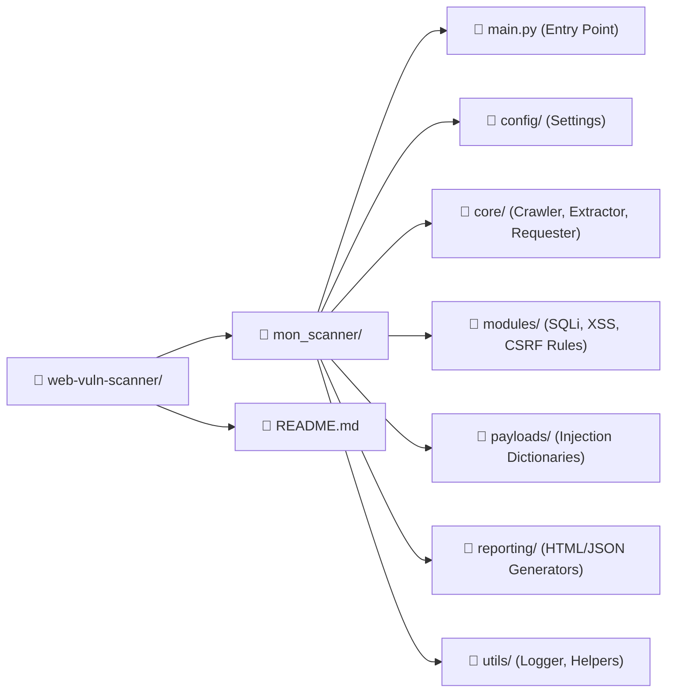

# Professional Web Vulnerability Scanner

## 📖 Explanation
This project is an automated, professional-grade Web Vulnerability Scanner built in Python. Unlike simple script-based tools, it features a complete engine that recursively crawls a target website, intelligently maps its attack surface (forms, inputs, and URL parameters), and systematically tests for common web vulnerabilities. Finally, it generates a clean, actionable HTML report detailing the findings along with remediation advice.

## 🎯 The Problem This Tool Solves
Modern web applications expose numerous endpoints, forms, and hidden parameters. Manually finding and testing every single input for vulnerabilities is a tedious, time-consuming, and error-prone process. This tool solves the problem of automated surface mapping and initial vulnerability discovery. By automating the reconnaissance and initial testing phases, it allows security professionals and developers to quickly identify weak points and focus their efforts on deeper analysis and patching.

## ⚙️ How It Works
The scanner operates in four distinct phases:
1. **Reconnaissance (Crawling):** The core engine starts at a target URL and crawls internal links recursively up to a configurable depth, maintaining session state.
2. **Extraction:** It parses the HTML DOM of every discovered page to extract actionable components: form actions, methods, visible/hidden inputs, and URL query parameters.
3. **Execution (Scanning):** Specialized modules process the extracted attack surface. They inject curated payloads from external dictionaries and analyze the HTTP responses to identify signatures of vulnerabilities (e.g., SQL syntax errors, reflected scripts, missing tokens).
4. **Reporting:** Findings are sorted by severity (Critical, High, Medium, Low) and synthesized into a beautiful HTML report containing the vulnerability context, payload, and remediation instructions.

## 💻 Technologies Used
- **Python 3:** Core logic and orchestration.
- **Requests:** Robust HTTP session management, handling timeouts and automatic redirections.
- **BeautifulSoup4 (bs4):** Advanced HTML parsing and DOM querying for data extraction.
- **Jinja2:** Templating engine for dynamic, aesthetic HTML report generation.
- **PyYAML:** Configuration management for easy tweaking of scanner settings (threads, depth, scopes).

## 💼 Business Value
- **Proactive Security:** Identifies critical vulnerabilities like SQLi and XSS before malicious actors can exploit them in a production environment.
- **Time and Cost Efficiency:** Automates repetitive manual testing processes, saving hours of security analyst time.
- **Clear Communication:** Generates professional, human-readable reports that bridge the gap between security concepts and developer implementation, providing direct remediation instructions.

## 🏗️ Architecture Design



## 📁 Project Organisation



## 🚀 Test The Project On A PC (Windows + PowerShell)

Follow these steps to test the scanner on your Windows machine using PowerShell. We will test it against `http://testphp.vulnweb.com`, an application legally provided by Acunetix for security testing.

### 1. Open PowerShell and navigate to the project root
```powershell
cd C:\Users\jamai\OneDrive\Desktop\web-vuln-scanner
```

### 2. Install the required dependencies
*(Ensure Python is installed on your system)*
```powershell
python -m pip install -r mon_scanner/requirements.txt
```

### 3. Run the Vulnerability Scanner
To run the scanner, you need to set the `PYTHONPATH` so the internal modules can resolve each other properly. Run the following command (setting depth to 1 for a quick test):
```powershell
$env:PYTHONPATH = "C:\Users\jamai\OneDrive\Desktop\web-vuln-scanner"; python -m mon_scanner.main -u http://testphp.vulnweb.com -d 1
```

### 4. View the Report
Once the execution finishes, navigate to the `reports/` folder that was just created inside `web-vuln-scanner/`. Open the generated HTML file (e.g., `report_testphp.vulnweb.com.html`) in your favorite web browser to see the professional vulnerability report!
