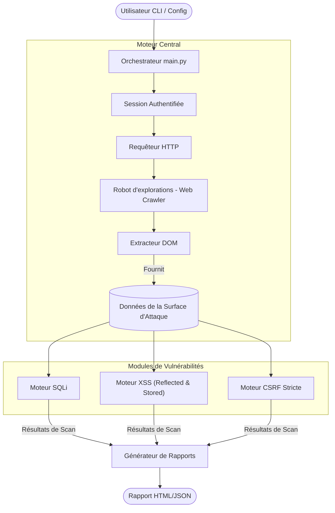
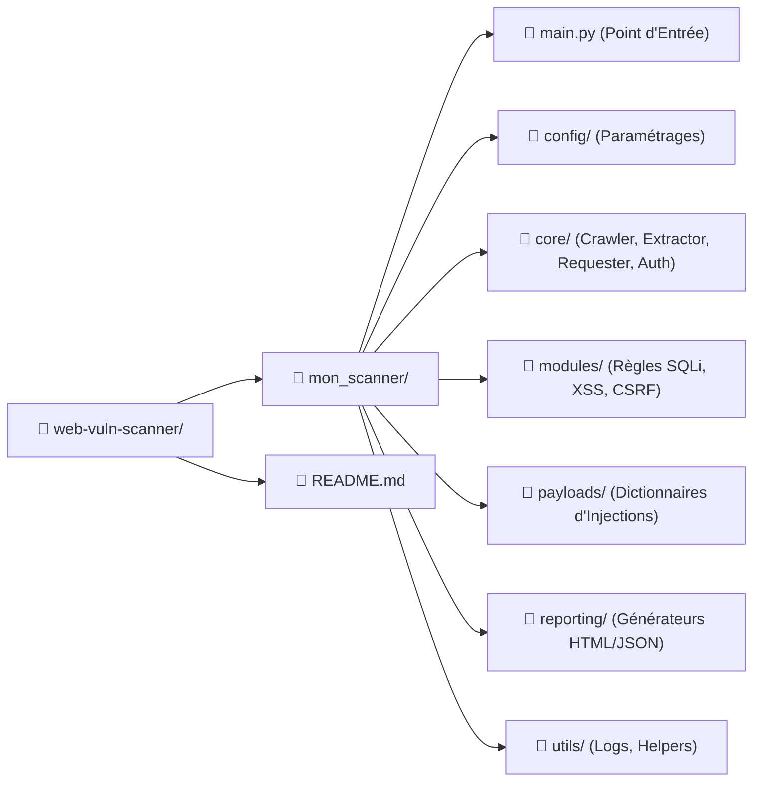

# Scanner Professionnel de Vulnérabilités Web

## 📖 Explication
Ce projet est un Scanner de Vulnérabilités Web professionnel et automatisé développé en Python. Contrairement aux simples outils basés sur des scripts, il dispose d'un moteur complet qui explore itérativement un site cible (crawling), géo-localise intelligemment sa surface d'attaque (formulaires, champs de saisie et paramètres d'URL), et teste systématiquement les vulnérabilités web les plus courantes. Enfin, il génère un rapport HTML clair et exploitable détaillant les résultats accompagnés de conseils de remédiation.

## 🎯 Le problème que cet outil résout
Les applications web modernes exposent de nombreux points de terminaison, formulaires et paramètres cachés. Trouver et tester manuellement chaque entrée pour découvrir d'éventuelles vulnérabilités est un processus fastidieux, chronophage et sujet aux erreurs. Cet outil résout le problème de la cartographie automatisée de la surface d'attaque et de la découverte initiale des vulnérabilités. En automatisant les phases de reconnaissance et de tests préliminaires, il permet aux professionnels de la sécurité et aux développeurs d'identifier rapidement les points faibles et de concentrer leurs efforts sur une analyse plus approfondie et sur l'application de correctifs.

## ⚙️ Comment ça marche
Le scanner fonctionne selon quatre phases distinctes :
1. **Reconnaissance (Crawling & Sessions) :** Le moteur central peut s'authentifier automatiquement sur l'application cible en extrayant d'abord les jetons de sécurité cachés (CSRF token sur la page de login) avant de démarrer sa session. Il parcourt ensuite itérativement les liens internes jusqu'à une profondeur paramétrable.
2. **Extraction :** Il analyse le DOM HTML de chaque page découverte pour en extraire les éléments exploitables : actions et méthodes de formulaires, champs de saisie visibles ou cachés, et les paramètres des requêtes URL.
3. **Exécution (Scanner) :** Des modules spécialisés (SQLi, XSS, CSRF) traitent la surface d'attaque identifiée : 
    - Validation stricte des failles **CSRF** sur les formulaires de transfert d'argent (vérification de signature manquante).
    - Fuzzing intensif pour détecter le **Reflected XSS** et persistance mémoire pour détecter les vulnérabilités graves de **Stored XSS** sur les pages d'historique.
4. **Génération de rapport (Reporting) :** Les découvertes sont classées en fonction de leur gravité (Critique, Haute, Moyenne, Basse) et regroupées dans un superbe rapport HTML contenant le contexte de la vulnérabilité, le payload l'ayant déclenché et les directives de remédiation à appliquer.

## 💻 Technologies Utilisées
- **Python 3 :** Logique centrale et orchestration.
- **Requests :** Gestion robuste des sessions HTTP (`requests.Session()`), support des timeouts, authentifications et redirections automatiques.
- **BeautifulSoup4 (bs4) :** Parsing HTML avancé et requêtes DOM pour l'extraction intelligente des données.
- **Jinja2 :** Moteur de templating pour la génération de rapports HTML esthétiques et dynamiques.
- **PyYAML :** Gestion de la configuration afin d'ajuster facilement les paramètres du scanner (threads, profondeur, ciblage).

## 💼 Valeur Business et Sécurité
- **Audit Connecté :** La capacité de s'authentifier automatiquement (`core/auth.py`) repousse les bordures du scan habituel, permettant de localiser les failles logiques au plus profond des espaces membres (Espaces bancaires, tableaux de bord).
- **Sécurité Proactive :** Identifie les vulnérabilités critiques comme le SQLi, le CSRF ciblé et le XSS avant que les pirates informatiques ne puissent les exploiter dans un environnement de production.
- **Efficacité en Temps et Coût :** Automatise les processus de tests manuels répétitifs, économisant ainsi des heures de travail précieuses aux analystes sécurité.
- **Communication Claire :** Génère des rapports professionnels compréhensibles par un être humain, comblant le vide entre les concepts orientés sécurité pure et l'implémentation pour le développeur.

## 🏗️ Architecture Générale (Design)



## 📁 Organisation du Projet



## 🚀 Tester le Projet sur un PC (Windows + PowerShell)

Suivez ces différentes étapes pour tester le scanner sur votre machine Windows depuis PowerShell. Nous allons ici réaliser un test basique sur le site `http://zero.webappsecurity.com`, une application bancaire légalement mise à la disposition du public pour s'entraîner aux tests de pénétration.

### 1. Ouvrez votre terminal et placez-vous à la racine du projet
```bash
cd <chemin_vers_web-vuln-scanner>
```

### 2. Installez les dépendances requises
*(Assurez-vous que Python soit bien installé et ajouté dans vos variables d'environnement)*
```bash
python -m pip install -r mon_scanner/requirements.txt
```

### 3. Lancez le web scanner avec Authentification
Afin de démarrer le scan, vous devrez vous assurer que les modules internes Python se trouvent. Sur Windows par exemple, exécutez la commande suivante à la racine :
```powershell
$env:PYTHONPATH = "."; python -m mon_scanner.main -u "http://zero.webappsecurity.com" -d 3 --login-url "http://zero.webappsecurity.com/login.html" --username "admin" --password "admin"
```

### 4. Visualisez le Rapport
Une fois que l'exécution indique la fin globale du test, rendez-vous dans le nouveau dossier `reports/` fraîchement créé à l'intérieur de `web-vuln-scanner/`. Ouvrez le fichier HTML généré (par exemple, `report_zero.webappsecurity.com.html`) dans votre navigateur préféré pour consulter les découvertes de failles CSRF avancées !
